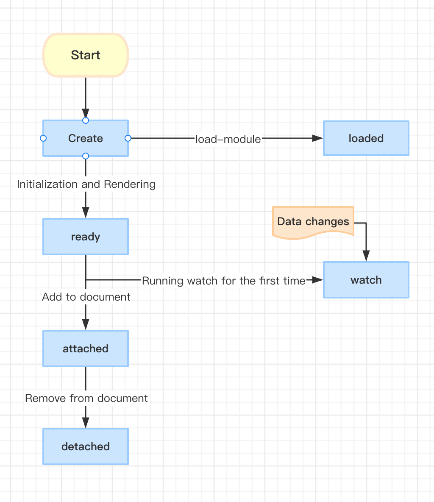

# loaded

The `loaded` lifecycle hook is triggered after all dependencies in the component template have been loaded. This stage ensures that all dependencies are loaded before rendering the component. This is a good time to remove the Loading style added during the `ready` stage.

## Example code

```html
<div id="logger">-</div>
<div style="color:red;">loaded : <span id="loaded"></span></div>
<script>
  setTimeout(()=>{
    const ele = document.createElement('test-loaded');
  },500);
</script>
```

<comp-viewer comp-name="test-loaded">

```
<div id="logger">-</div>
<div style="color:red;">loaded : <span id="loaded"></span></div>
<script>
  setTimeout(()=>{
    const ele = document.createElement('test-loaded');
  },500);
</script>
```

```html
<template component>
  <l-m src="https://kirakiray.github.io/ofa-v4-docs/docs/publics/comps/punch-logo.html"></l-m>
  <punch-logo></punch-logo>
  <script>
    let count = 0;
    export default {
      tag: "test-loaded",
      ready(){
        $("#loaded").push(`<div>ready - ${this.shadow.$('l-m').ele.loaded}</div>`);
      },
      loaded(){
        count++;
        $("#logger").text = count;
        $("#loaded").push(`<div>loaded - ${this.shadow.$('l-m').ele.loaded}</div>`);
      }
    };
  </script>
</template>
```

</comp-viewer>

## Lifecycle Flowchart


